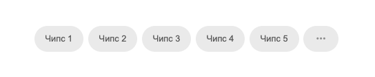
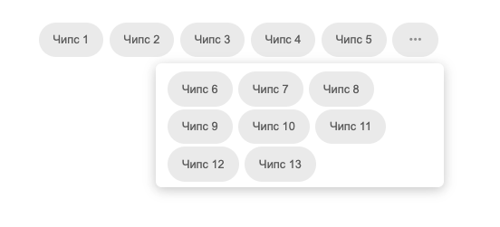

# Тестовое задание

Необходимо реализовать компонент, отображающий список чипсов:

- Обратите внимание, что чипсы располагаются в одну строчку. Те элементы, которые не поместились в одну строчку, можно увидеть в попапе, кликнув на соответствующую кнопку.
- Список должен подстраиваться под изменение размеров ширины экрана.
- Есть возможность выбора чипса по клику.
- Компонент может быть переиспользован.
- Чипс может быть использован отдельно от списка. 

Примерная реализация может выглядеть так:

#### Рекомендации по технологиям

- Typescript
- React
- Сторонние библиотеки можно использовать только для отображения попапа

Результат необходимо оформить в виде репозитория на github, не забыв добавить описание и инструкцию по запуску в файл README.md .
